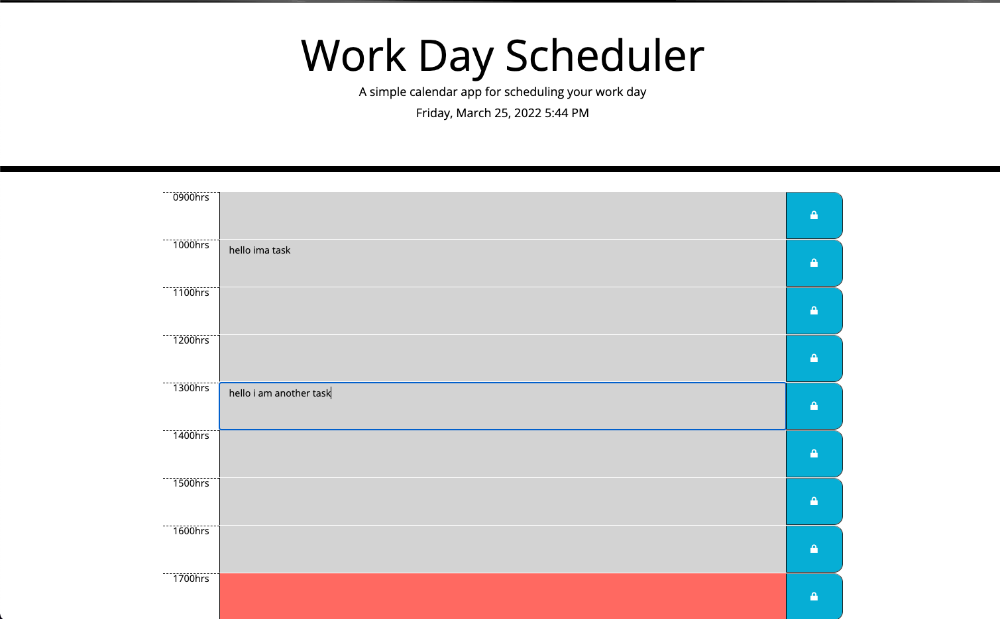

# Work Day Scheduler App

-Work day scheduler project scope
    -User will be presented with a daily planner
    -Planner will be display the current time and date
    -Planner will display a list of text area's with the work hours displayed on the left
    -Planner will indicate the time of the task if its in the present , past, or future
    -User will be able to save the task and should be reload.

### Made with HTML,CSS,Bootstrap,JavaScript,Jquery,Moment.js 

